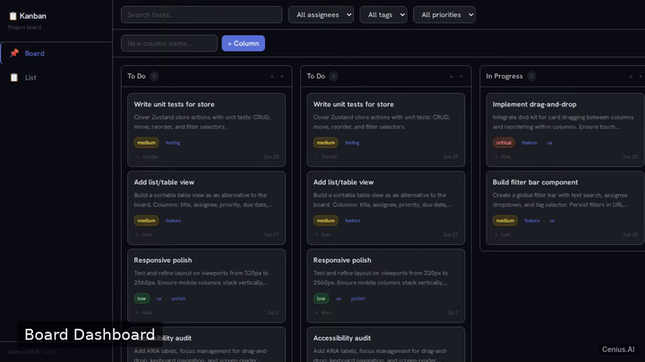
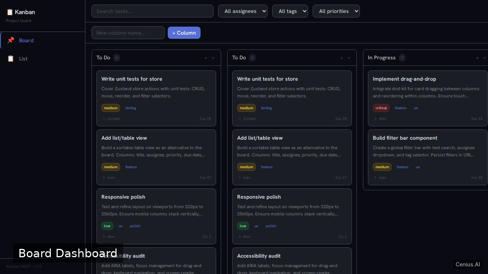
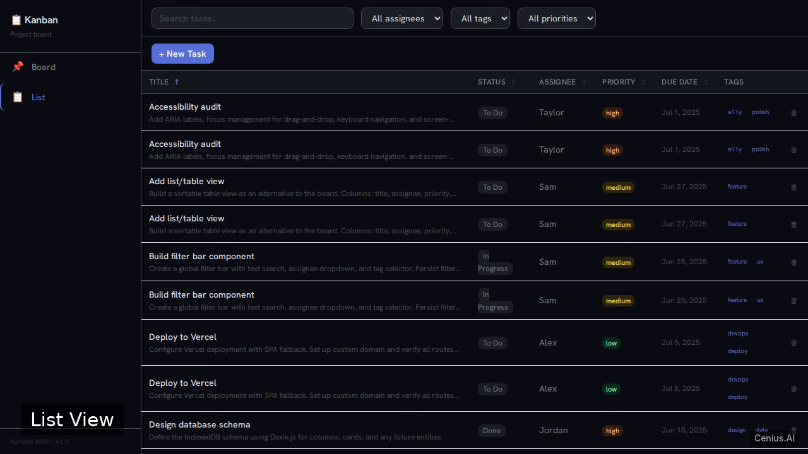

# Kanban Board MVP — complete Vite kanban board example app

A Vite kanban board, open-source and ready to self-host: that's **Kanban Board MVP**. Build a responsive, production-quality Kanban board single-page application (SPA) that runs entirely in the browser without a backend. Kanban Board MVP ships complete — source, design assets, seed data — under the Apache-2.0 license; no cloud account needed. [Remix Kanban Board MVP on cenius.ai](https://cenius.ai/marketplace/p/kanban-board-mvp?ref=gh&utm_campaign=kanban-board-mvp-vite) for a custom build.

  

> **▶ [Open & edit in cenius.ai](https://cenius.ai/marketplace/p/kanban-board-mvp?ref=gh&utm_campaign=kanban-board-mvp-vite)** — one click to an editable workspace: describe changes in plain English, get an instant preview, one-click deploy and host. Modifications made on the platform come with full rebrand & relicense rights.

_Local clone? See [Quick start](#quick-start) below. cenius.ai is the zero-setup path._

## Demo

📽 **[Watch the walkthrough](https://cenius.ai/marketplace/p/kanban-board-mvp?ref=gh&utm_campaign=kanban-board-mvp-vite)** — plays on cenius.ai · [MP4 file](.github/media/demo.mp4)

## Screenshots

  

## Architecture

No external services required: the entire kanban board runs from this Vite repo (30 files). Top-level layout: `public/`, `src/`. Full setup details: [`INSTALL.md`](INSTALL.md).

## Quick start

See [`INSTALL.md`](INSTALL.md) for full setup and usage instructions.

## Usage guide

Once the development server is running (see [INSTALL.md](INSTALL.md)), open your browser to the provided address (usually `http://localhost:5173`).

### Board View (Default Route `/`)

- The board displays columns for different task statuses (e.g., “To Do”, “In Progress”, “Done”).
- Each column contains draggable task cards. You can:
  - Drag a card from one column to another to change its status.
  - Reorder cards within a column by dragging.
- **Creating a task**: Use the “Add Task” button (visible in the board header) to open the `TaskForm` and fill in title, description, status, and priority.
- **Filtering**: Use the `FilterBar` above the board to filter tasks by title (search), status, or priority. The board updates in real time.

### List View (Route `/list`)

- Switch to the list view by clicking the “List” item in the sidebar (`Sidebar` component).
- This view displays all tasks in a sortable table/list. You can sort by columns like title, status, priority, or due date.
- The `FilterBar` is also available here to narrow down the displayed tasks.
- Click on a task row to edit its details (opens the `TaskForm`).

### Data Persistence

All tasks are automatically saved to the browser’s IndexedDB database (via Dexie). Refreshing the page or reopening the app will restore your board exactly as you left it. On the very first visit, a set of seed tasks is automatically inserted so you can see the board in action.

**Clearing data**: To reset the board, clear the IndexedDB database `kanban-app` in your browser’s developer tools (Application → IndexedDB).

_Full guide: [`USAGE.md`](USAGE.md)_

## FAQ

### How do I run Kanban Board MVP on my own server?

Clone this repository and run `./install.sh`, then start the app as described in [`INSTALL.md`](INSTALL.md). Kanban Board MVP is fully self-hostable — no external services are required to try it.

### What is Kanban Board MVP built with?

Kanban Board MVP runs on Vite. This repo holds the full production source: you can inspect every part of it before deploying.

### Can I change Kanban Board MVP without writing code?

The easiest route: [visit the project on cenius.ai](https://cenius.ai/marketplace/p/kanban-board-mvp?ref=gh&utm_campaign=kanban-board-mvp-vite), tell the platform what to change, and collect the updated build. No source-editing needed.

### Can I rebrand or white-label Kanban Board MVP?

Absolutely. [Open it on cenius.ai](https://cenius.ai/marketplace/p/kanban-board-mvp?ref=gh&utm_campaign=kanban-board-mvp-vite) and remix it there — platform modifications come with full rebrand and relicense rights over your derivative, so the result is entirely yours.

### Can I build a business on Kanban Board MVP?

Yes — Apache-2.0-licensed, so commercial use, modification, and distribution are all permitted. Read the full terms in [LICENSE](LICENSE).

## License & rebranding

Released under the [Apache License 2.0](LICENSE) (© 2026 Cenius AI) — free for personal and commercial use. The Cenius name/logo are trademarks (see NOTICE).

**Need a customized version?** [Remix this app on cenius.ai](https://cenius.ai/marketplace/p/kanban-board-mvp?ref=gh&utm_campaign=kanban-board-mvp-vite) — modifications made on the platform come with **full rebrand & relicense rights** over your derivative.

## Built with cenius.ai

This entire application — code, design, seeded demo data — was generated on **[cenius.ai](https://cenius.ai)** from a plain-English description.

- 🚀 [Build your own app on cenius.ai](https://cenius.ai)
- 🎛️ [Remix Kanban Board MVP on the marketplace](https://cenius.ai/marketplace/p/kanban-board-mvp?ref=gh&utm_campaign=kanban-board-mvp-vite) — open it in a workspace, prompt for changes, and ship your own version.

More open-source apps: [the Cenius-ai catalog](https://github.com/Cenius-ai) · [showcase index](https://github.com/Cenius-ai/showcase)
